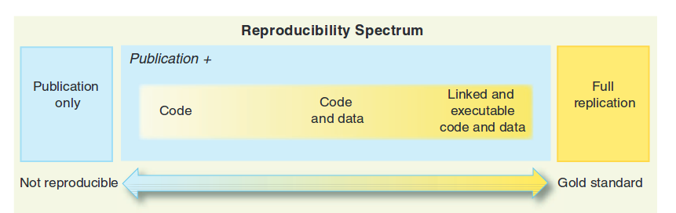
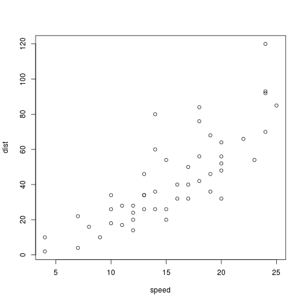

Clase1: Investigacion Reproducible
========================================================
author: Derek Corcoran
date: "02 October, 2017"
autosize: true
transition: rotate

¿Que es investiagación reporoducible?
========================================================

- Código, datos (**Crudos**) y texto entrelazados
- en R: Rmarkdown (Rmd) y Rpresentation (Rpres) entre otros

Reproducibilidad en R
========================================================

***

1. Una carpeta
    + Datos crudos (csv, xls, html, json)
    + Codigo y texto (Rmd, Rpres, shiny)
    + Resultados (Manuscrito, Pagina Web, App)

Ejemplo
========================================================

