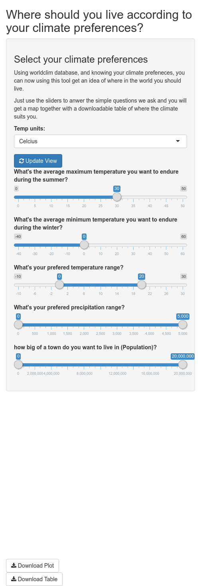

Clase 1: Investigación Reproducible
========================================================
author: Derek Corcoran
date: "03/10, 2017"
autosize: true
transition: rotate

¿Que es investiagación reporoducible?
========================================================

- Código, datos (**Crudos**) y texto entrelazados
- en R: Rmarkdown (Rmd) y Rpresentation (Rpres) entre otros

Reproducibilidad en R
========================================================

***

1. Una carpeta
    + Datos crudos (csv, xls, html, json)
    + Codigo y texto (Rmd, Rpres, shiny)
    + Resultados (Manuscrito, Pagina Web, App)

Crear un nuevo Rmarkdown
========================================================

Partes de un Rmd
========================================================
left: 30%

1. Chunks
2. Texto
3. Inline code
4. [Cheat cheat Rmd](https://www.rstudio.com/wp-content/uploads/2015/02/rmarkdown-cheatsheet.pdf)

***

Ejemplo
========================================================

Desde el 03-09-2017 al 03-10-2017, han habido 1. El sismo de mayor intensidad en ese tiempo sismos sobre magnitud 5.8 en Chile y sus cercanias en las localidades de 95km WSW of Illapel, Chile.

