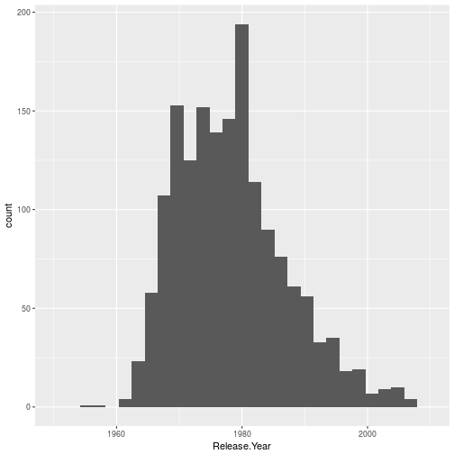

<style>
.reveal h1, .reveal h2, .reveal h3 {
  word-wrap: normal;
  -moz-hyphens: none;
}
</style>

<style>
.small-code pre code {
  font-size: 1em;
}
</style>

Clase2 Tidy Data y manipulación de datos
========================================================
author: Derek Corcoran
date: "07/10, 2017"
autosize: true
transition: rotate

Estructura de datos
========================================================
incremental: true

- Vector: Un conjunto lineal de datos (Secuencia genica, serie de tiempo)
- Matrix: Una tabla con solo números
- Data Frame: Una tabla donde cada columna tiene un tipo de datos (Estandard dorado)
- List: Aqui podemos meter lo que queramos

***


Vector
========================================================


Data Frame
========================================================


****

dplyr
========================================================
incremental: true
 
Paquete con pocas funciones muy poderosas

- Filter
- Group_by
- Summarise
- Select
- Join

Filter
=================


```r
library(readr)
library(ggplot2)
classic_rock <- read_csv("https://raw.githubusercontent.com/fivethirtyeight/data/master/classic-rock/classic-rock-song-list.csv")
colnames(classic_rock)<- make.names(colnames(classic_rock))
ggplot(classic_rock, aes(x = Release.Year)) + geom_histogram()  + xlim(c(1950, 2010))
```



Slide With Plot
========================================================


