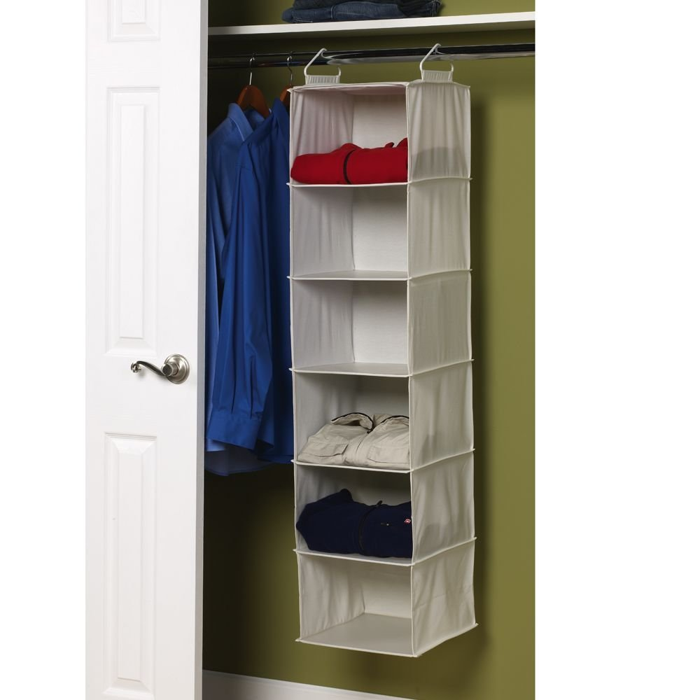

<style>
.reveal h1, .reveal h2, .reveal h3 {
  word-wrap: normal;
  -moz-hyphens: none;
}
</style>

<style>
.small-code pre code {
  font-size: 1em;
}
</style>

Clase 2 Tidy Data y manipulación de datos
========================================================
author: Derek Corcoran
date: "08/10, 2017"
autosize: true
transition: rotate

Estructura de datos
========================================================
incremental: true

- Vector: Un conjunto lineal de datos (Secuencia genica, serie de tiempo)
- Matrix: Una tabla con solo números
- Data Frame: Una tabla donde cada columna tiene un tipo de datos (Estandard dorado)
- List: Aqui podemos meter lo que queramos

***


Vector
========================================================
left: 60%
incremental: true

* Secuencia lineal de datos
* Pueden ser de muchos tipos (numéricos, de carácteres, logicos, etc.)
* Ejemplo data(uspop)
* para crear uno c(1,4,6,7,8)
* para Subsetear un vector se pone el indice entre []
* uspop[4], uspop[2:10], uspop[c(3,5,8)]

***




Data Frame
========================================================
incremental: true
* Una tabla, cada columna un tipo de datos (Numérico, lógico, etc)
* Cada columna un vector
* Ejemplo data(iris)
* Para subsetear data.frame[filas,columnas]
* Ejemplos iris[,3], iris[,"Petal.Length"], iris[2:5,c(1,5)]


***


Tidy Data 
========================================================
incremental: true


* Cada columna una variable
* Cada fila una observación

untidy data
===========


untidy data
===========


prueba de la limpieza
==============
class: small-code

* Graficando usando ggplot2
* Seleccionar variable x e y, 
* graficar (geom_boxplot para categorias, geom_point para numerico)

```r
data(iris)
library(ggplot2)
ggplot(iris, aes(x = Species, y = Petal.Length)) + geom_boxplot()
```

***


dplyr
========================================================
incremental: true
 
Paquete con pocas funciones muy poderosas

- Filter
- Group_by
- Summarise
- Select
- Join

Filter
=================


```r
library(readr)
library(ggplot2)
classic_rock <- read_csv("https://raw.githubusercontent.com/fivethirtyeight/data/master/classic-rock/classic-rock-song-list.csv")
colnames(classic_rock)<- make.names(colnames(classic_rock))
ggplot(classic_rock, aes(x = Release.Year)) + geom_histogram()  + xlim(c(1950, 2010))
```


Slide With Plot
========================================================


```
Error in iris %>% mutate(petal.proportion = Petal.Length/Petal.Width) %>%  : 
  could not find function "%>%"
```
