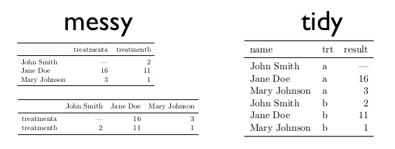

<style>
.reveal h1, .reveal h2, .reveal h3 {
  word-wrap: normal;
  -moz-hyphens: none;
}
</style>

<style>
.small-code pre code {
  font-size: 1em;
}
</style>

Clase 2 Tidy Data y manipulación de datos
========================================================
author: Derek Corcoran
date: "09/10, 2017"
autosize: true
transition: rotate

Estructura de datos
========================================================
incremental: true

- Vector: Un conjunto lineal de datos (Secuencia genica, serie de tiempo)
- Matrix: Una tabla con solo números
- Data Frame: Una tabla donde cada columna tiene un tipo de datos (Estandard dorado)
- List: Aqui podemos meter lo que queramos

***


Vector
========================================================
left: 60%
incremental: true

* Secuencia lineal de datos
* Pueden ser de muchos tipos (numéricos, de carácteres, logicos, etc.)
* Ejemplo data(uspop)
* para crear uno c(1,4,6,7,8)
* para Subsetear un vector se pone el indice entre []
* uspop[4], uspop[2:10], uspop[c(3,5,8)]

***


Data Frame
========================================================
incremental: true
* Una tabla, cada columna un tipo de datos (Numérico, lógico, etc)
* Cada columna un vector
* Ejemplo data(iris)
* Para subsetear data.frame[filas,columnas]
* Ejemplos iris[,3], iris[,"Petal.Length"], iris[2:5,c(1,5)]


***


Tidy Data 
========================================================
incremental: true


* Cada columna una variable
* Cada fila una observación

untidy data
===========


untidy data
===========


prueba de la limpieza
==============
class: small-code

* Generando modelos lineales usando lm/glm
* Formato lm(y ~ x1 + x2 + ... + xn, data = Data.frame)

```r
data(iris)
model1 <- lm(Petal.Length ~ Species, data = iris)
library(stargazer)
stargazer(model1, type = "html", single.row=TRUE)
```

***

<table style="text-align:center"><tr><td colspan="2" style="border-bottom: 1px solid black"></td></tr><tr><td style="text-align:left"></td><td><em>Dependent variable:</em></td></tr>
<tr><td></td><td colspan="1" style="border-bottom: 1px solid black"></td></tr>
<tr><td style="text-align:left"></td><td>Petal.Length</td></tr>
<tr><td colspan="2" style="border-bottom: 1px solid black"></td></tr><tr><td style="text-align:left">Speciesversicolor</td><td>2.798<sup>***</sup> (0.086)</td></tr>
<tr><td style="text-align:left">Speciesvirginica</td><td>4.090<sup>***</sup> (0.086)</td></tr>
<tr><td style="text-align:left">Constant</td><td>1.462<sup>***</sup> (0.061)</td></tr>
<tr><td colspan="2" style="border-bottom: 1px solid black"></td></tr><tr><td style="text-align:left">Observations</td><td>150</td></tr>
<tr><td style="text-align:left">R<sup>2</sup></td><td>0.941</td></tr>
<tr><td style="text-align:left">Adjusted R<sup>2</sup></td><td>0.941</td></tr>
<tr><td style="text-align:left">Residual Std. Error</td><td>0.430 (df = 147)</td></tr>
<tr><td style="text-align:left">F Statistic</td><td>1,180.161<sup>***</sup> (df = 2; 147)</td></tr>
<tr><td colspan="2" style="border-bottom: 1px solid black"></td></tr><tr><td style="text-align:left"><em>Note:</em></td><td style="text-align:right"><sup>*</sup>p<0.1; <sup>**</sup>p<0.05; <sup>***</sup>p<0.01</td></tr>
</table>


dplyr
========================================================
incremental: true
 
Paquete con pocas funciones [muy poderosas](https://www.rstudio.com/wp-content/uploads/2015/02/data-wrangling-cheatsheet.pdf)

- *summarize*
- *group_by*
- *filter* 
- *select* junto a *starts_with* o *ends_with*
- *%>%* pipeline

summarize y group_by
=================
- *summarize *resume una variable
- *Group_by* reune observaciones segun una variable
- Usadas en conjunto muy poderosas


```r
library(dplyr)
library(knitr)
MEAN <- summarize(iris, MEAN.PETAL = mean(Petal.Length))
kable(MEAN)
```


| MEAN.PETAL|
|----------:|
|      3.758|

summarize y group_by (continuado)
=================


```r
library(dplyr)
library(knitr)
MEAN <- group_by(iris, Species)
MEAN <- summarize(MEAN, MEAN.PETAL = mean(Petal.Length))
kable(MEAN)
```


|Species    | MEAN.PETAL|
|:----------|----------:|
|setosa     |      1.462|
|versicolor |      4.260|
|virginica  |      5.552|

Pipeline (%>%)
=================
class: small-code

- Ahorra lineas, se parte con un data.frame
- Se agregan funciones de dplyr hasta llegar al resultado deseado


```r
library(dplyr)
library(knitr)
MEAN <- iris %>% group_by(Species) %>% summarize(MEAN.PETAL = mean(Petal.Length))
kable(MEAN)
```


|Species    | MEAN.PETAL|
|:----------|----------:|
|setosa     |      1.462|
|versicolor |      4.260|
|virginica  |      5.552|

Pipeline (%>%) otro ejemplo
==========================


```r
library(dplyr)
library(knitr)
MEAN <- iris %>% group_by(Species) %>% summarize_all(mean)
kable(MEAN)
```


|Species    | Sepal.Length| Sepal.Width| Petal.Length| Petal.Width|
|:----------|------------:|-----------:|------------:|-----------:|
|setosa     |        5.006|       3.428|        1.462|       0.246|
|versicolor |        5.936|       2.770|        4.260|       1.326|
|virginica  |        6.588|       2.974|        5.552|       2.026|

Filter
=======
incremental:true
- Selecciona segun una o más variables

|simbolo |significado     |simbolo_cont |significado_cont |
|:-------|:---------------|:------------|:----------------|
|<       |Mayor que       |!=           |distinto a       |
|>       |Menor que       |%in%         |dentro del grupo |
|==      |Igual a         |is.na        |es NA            |
|>=      |mayor o igual a |!is.na       |no es NA         |
|<=      |menor o igual a |&#124; &     |o, y             |

Ejemplos de filter agregando a lo anterior
===============================
class: small-code


```r
library(dplyr)
data("iris")
DF <- iris %>% filter(Species != "versicolor") %>% group_by(Species) %>% summarise_all(mean)
kable(DF)
```


|Species   | Sepal.Length| Sepal.Width| Petal.Length| Petal.Width|
|:---------|------------:|-----------:|------------:|-----------:|
|setosa    |        5.006|       3.428|        1.462|       0.246|
|virginica |        6.588|       2.974|        5.552|       2.026|


Select
=======================
class: small-code

* Selecciona columnas dentro de un data.frame


```r
library(dplyr)
library(knitr)
data(nasa)
Nasa2 <- as.data.frame(nasa)
Temp <- Nasa2 %>% filter(year != 1995) %>% group_by(year) %>% select(contains("temp")) %>% summarize_all(mean)
```
***

```r
kable(Temp)
```


| year| surftemp| temperature|
|----:|--------:|-----------:|
| 1996| 295.8562|    297.1005|
| 1997| 296.7291|    297.9566|
| 1998| 297.1221|    298.7028|
| 1999| 295.6850|    298.1364|
| 2000| 295.7263|    298.3358|


Ejercicios
========================================================
incremental: true

* Usando la base de datos *storm* del paquete *dplyr*, calcula la velocidad promedio y diametro promedio (hu_diameter) de las tormentas declaradas huracanes por año
    + solucion:
    + storms %>% filter(status == "hurricane") %>% select(year, wind, hu_diameter) %>% group_by(year) %>% summarize_all(mean)


