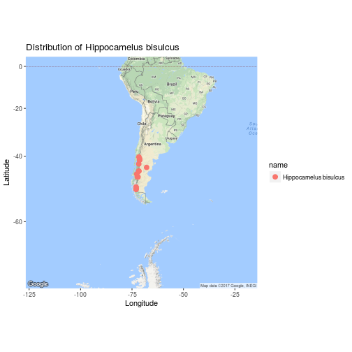

<style>
.reveal h1, .reveal h2, .reveal h3 {
  word-wrap: normal;
  -moz-hyphens: none;
}
</style>

<style>
.small-code pre code {
  font-size: 1em;
}
</style>

Clase 2 El Hadleyverso y el Tidyverso
========================================================
author: Derek Corcoran
date: "12/10, 2017"
autosize: true
transition: rotate
========================================================
class: small-code


Hadleyverso: Conjunto de paquetes creado por Hadley Wickham, generados para hacer el trabajo con Tidy Data mucho más fácil


***

[Tidyverso](https://www.tidyverse.org): Desde que David Robinson y algunos otros empezaron a aportar


```r
install.packages("tidyverse")
library(tidyverse)
```


Paquetes del Tidyverso
========================================================
incremental: true

En el corazón del Tidyverso

* dplyr (Clase anterior)
* tidyr (Hoy)
* ggplot2 (Próxima clase)
* readr (ya la estamos usando)
* purrr (En clase sobre loops)
 
 ***
 
Adyacente al Tidyverso

* stringr para carácteres (Palabras)
* lubridate para fechas y fechas/horas
* forcats Para variables categóricas
* hms para horas

Tidyr
====================

Dos funciones

* *gather* hace que tablas anchas se vuelvan largas
* *spread* hace que tablas largas se vuelvan anchan

***


Gather
=============
class: small-code


```r
data(iris)
mini_iris <- iris[c(1, 51, 101), ]
kable(mini_iris)
```


|    | Sepal.Length| Sepal.Width| Petal.Length| Petal.Width|Species    |
|:---|------------:|-----------:|------------:|-----------:|:----------|
|1   |          5.1|         3.5|          1.4|         0.2|setosa     |
|51  |          7.0|         3.2|          4.7|         1.4|versicolor |
|101 |          6.3|         3.3|          6.0|         2.5|virginica  |

Gather (cont)
=============
class: small-code


```r
MI <- mini_iris %>% gather(key = flower_att, value = measurement, -Species)
kable(MI)
```


|Species    |flower_att   | measurement|
|:----------|:------------|-----------:|
|setosa     |Sepal.Length |         5.1|
|versicolor |Sepal.Length |         7.0|
|virginica  |Sepal.Length |         6.3|
|setosa     |Sepal.Width  |         3.5|
|versicolor |Sepal.Width  |         3.2|
|virginica  |Sepal.Width  |         3.3|
|setosa     |Petal.Length |         1.4|
|versicolor |Petal.Length |         4.7|
|virginica  |Petal.Length |         6.0|
|setosa     |Petal.Width  |         0.2|
|versicolor |Petal.Width  |         1.4|
|virginica  |Petal.Width  |         2.5|


spread
============

```r
M <- spread(MI, flower_att, measurement)
kable(M)
```


|Species    | Petal.Length| Petal.Width| Sepal.Length| Sepal.Width|
|:----------|------------:|-----------:|------------:|-----------:|
|setosa     |          1.4|         0.2|          5.1|         3.5|
|versicolor |          4.7|         1.4|          7.0|         3.2|
|virginica  |          6.0|         2.5|          6.3|         3.3|


Duda clase anterior
===========
class: small-code


```r
library(dplyr)
data("iris")
DF <- iris %>% group_by(Species)  %>% select(contains("Petal")) %>% summarise_all(funs(mean, sd))
kable(DF)
```


|Species    | Petal.Length_mean| Petal.Width_mean| Petal.Length_sd| Petal.Width_sd|
|:----------|-----------------:|----------------:|---------------:|--------------:|
|setosa     |             1.462|            0.246|       0.1736640|      0.1053856|
|versicolor |             4.260|            1.326|       0.4699110|      0.1977527|
|virginica  |             5.552|            2.026|       0.5518947|      0.2746501|


Ejercicios
==============
incremental: true
class: small-code
* ¿Como paso de esto?

```r
counts_df <- data.frame(
  day = c("Monday", "Tuesday", "Wednesday"),
  wolf = c(2, 1, 3),
  hare = c(20, 25, 30),
  fox = c(4, 4, 4)
)
kable(counts_df)
```


|day       | wolf| hare| fox|
|:---------|----:|----:|---:|
|Monday    |    2|   20|   4|
|Tuesday   |    1|   25|   4|
|Wednesday |    3|   30|   4|

* a tidy data?

Solución
==============
class: small-code


```r
DF <- counts_df %>% gather(key = Species, value = Count, -day)
kable(DF)
```


|day       |Species | Count|
|:---------|:-------|-----:|
|Monday    |wolf    |     2|
|Tuesday   |wolf    |     1|
|Wednesday |wolf    |     3|
|Monday    |hare    |    20|
|Tuesday   |hare    |    25|
|Wednesday |hare    |    30|
|Monday    |fox     |     4|
|Tuesday   |fox     |     4|
|Wednesday |fox     |     4|


Ejercicio 2
=================
class: small-code
a. Quedarse con solo las observaciones que tienen coordenadas geograficas

b. Cuantas observaciones son de observacion humana y cuantas de especimen de museo? 

```r
library(dismo)
library(dplyr)
Huemul <- gbif('Hippocamelus', 'bisulcus', down=TRUE)
colnames(Huemul)
```

```
  [1] "accessRights"                        
  [2] "adm1"                                
  [3] "adm2"                                
  [4] "basisOfRecord"                       
  [5] "catalogNumber"                       
  [6] "class"                               
  [7] "classKey"                            
  [8] "cloc"                                
  [9] "collectionCode"                      
 [10] "collectionID"                        
 [11] "continent"                           
 [12] "coordinatePrecision"                 
 [13] "coordinateUncertaintyInMeters"       
 [14] "country"                             
 [15] "crawlId"                             
 [16] "datasetID"                           
 [17] "datasetKey"                          
 [18] "datasetName"                         
 [19] "dateIdentified"                      
 [20] "day"                                 
 [21] "depth"                               
 [22] "depthAccuracy"                       
 [23] "disposition"                         
 [24] "dynamicProperties"                   
 [25] "elevation"                           
 [26] "elevationAccuracy"                   
 [27] "endDayOfYear"                        
 [28] "establishmentMeans"                  
 [29] "eventDate"                           
 [30] "eventRemarks"                        
 [31] "eventTime"                           
 [32] "family"                              
 [33] "familyKey"                           
 [34] "fieldNumber"                         
 [35] "fullCountry"                         
 [36] "gbifID"                              
 [37] "genericName"                         
 [38] "genus"                               
 [39] "genusKey"                            
 [40] "geodeticDatum"                       
 [41] "georeferencedBy"                     
 [42] "georeferencedDate"                   
 [43] "georeferenceProtocol"                
 [44] "georeferenceSources"                 
 [45] "georeferenceVerificationStatus"      
 [46] "higherClassification"                
 [47] "higherGeography"                     
 [48] "http://unknown.org/occurrenceDetails"
 [49] "identificationID"                    
 [50] "identificationQualifier"             
 [51] "identificationRemarks"               
 [52] "identificationVerificationStatus"    
 [53] "identifiedBy"                        
 [54] "identifier"                          
 [55] "individualCount"                     
 [56] "informationWithheld"                 
 [57] "institutionCode"                     
 [58] "institutionID"                       
 [59] "ISO2"                                
 [60] "key"                                 
 [61] "kingdom"                             
 [62] "kingdomKey"                          
 [63] "language"                            
 [64] "lastCrawled"                         
 [65] "lastInterpreted"                     
 [66] "lastParsed"                          
 [67] "lat"                                 
 [68] "license"                             
 [69] "locality"                            
 [70] "locationAccordingTo"                 
 [71] "lon"                                 
 [72] "modified"                            
 [73] "month"                               
 [74] "nomenclaturalCode"                   
 [75] "occurrenceID"                        
 [76] "occurrenceRemarks"                   
 [77] "occurrenceStatus"                    
 [78] "order"                               
 [79] "orderKey"                            
 [80] "organismID"                          
 [81] "organismRemarks"                     
 [82] "otherCatalogNumbers"                 
 [83] "ownerInstitutionCode"                
 [84] "phylum"                              
 [85] "phylumKey"                           
 [86] "preparations"                        
 [87] "previousIdentifications"             
 [88] "protocol"                            
 [89] "publishingCountry"                   
 [90] "publishingOrgKey"                    
 [91] "recordedBy"                          
 [92] "recordNumber"                        
 [93] "references"                          
 [94] "rights"                              
 [95] "rightsHolder"                        
 [96] "scientificName"                      
 [97] "sex"                                 
 [98] "species"                             
 [99] "speciesKey"                          
[100] "specificEpithet"                     
[101] "startDayOfYear"                      
[102] "taxonID"                             
[103] "taxonKey"                            
[104] "taxonRank"                           
[105] "type"                                
[106] "verbatimCoordinateSystem"            
[107] "verbatimEventDate"                   
[108] "verbatimLocality"                    
[109] "vernacularName"                      
[110] "year"                                
[111] "downloadDate"                        
```

Solucion a
=====================
class: small-code


```r
Sola <- Huemul %>% dplyr::select(lon, lat, basisOfRecord) %>% filter(!is.na(lat) & !is.na(lon))
kable(Sola)
```


|       lon|       lat|basisOfRecord      |
|---------:|---------:|:------------------|
| -72.97712| -51.01511|HUMAN_OBSERVATION  |
| -72.43751| -47.20485|HUMAN_OBSERVATION  |
| -73.01456| -51.03635|HUMAN_OBSERVATION  |
| -73.03190| -51.17531|HUMAN_OBSERVATION  |
| -72.72944| -46.25602|HUMAN_OBSERVATION  |
| -71.31538| -41.30110|PRESERVED_SPECIMEN |
| -71.31538| -41.30110|PRESERVED_SPECIMEN |
| -71.30989| -40.81978|PRESERVED_SPECIMEN |
| -71.31538| -41.30110|PRESERVED_SPECIMEN |
| -73.02467| -50.46476|PRESERVED_SPECIMEN |
| -71.33186| -41.26523|PRESERVED_SPECIMEN |
| -73.01764| -50.46747|PRESERVED_SPECIMEN |
| -71.70000| -45.26667|PRESERVED_SPECIMEN |
| -71.70000| -45.26667|PRESERVED_SPECIMEN |
| -71.70000| -45.26667|PRESERVED_SPECIMEN |
| -72.08000| -47.25000|PRESERVED_SPECIMEN |
| -71.64718| -40.22605|PRESERVED_SPECIMEN |
| -67.88534| -43.99376|PRESERVED_SPECIMEN |
| -71.71094| -42.75692|HUMAN_OBSERVATION  |
| -71.36714| -41.13574|PRESERVED_SPECIMEN |

Solucion b
=====================
class: small-code


```r
Solb <- Huemul %>% group_by(basisOfRecord) %>% summarize(N = n())
kable(Solb)
```


|basisOfRecord      |   N|
|:------------------|---:|
|HUMAN_OBSERVATION  | 100|
|PRESERVED_SPECIMEN |  60|


El regalo
==================
class: small-code

```r
install.packages("mapr", dependencies = TRUE)
```

* probar map_leaflet(dat)


```r
library("mapr")
library("spocc")
dat <- occ(query = 'Hippocamelus bisulcus', from = 'gbif', has_coords = TRUE, limit = 50)
map_ggmap(dat)
```




Ejercicio 3
==================
incremental: true

* Entrar a [INE ambiental](http://www.ine.cl/estadisticas/medioambiente/series-cronologicas-vba) y bajar la base de datos de Dimensión Aire.
* Generar una base de datos **tidy** con las siguientes 5 columnas
    + El nombre de la localidad donde se encuntra la estación
    + El año en que se tomo la medida
    + El mes en que se tomo la medida
    + La temperatura media de ese mes
    + La media del mp25 de ese mes
    + Humedad relativa media mensual
* De la base de datos anterior obterner un segundo data frame en la cual calculen para cada variable y estación la media y desviación estandar para cada mes
