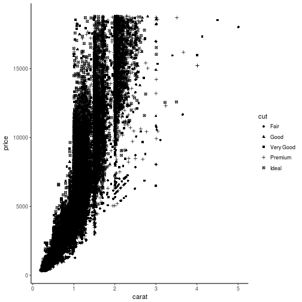
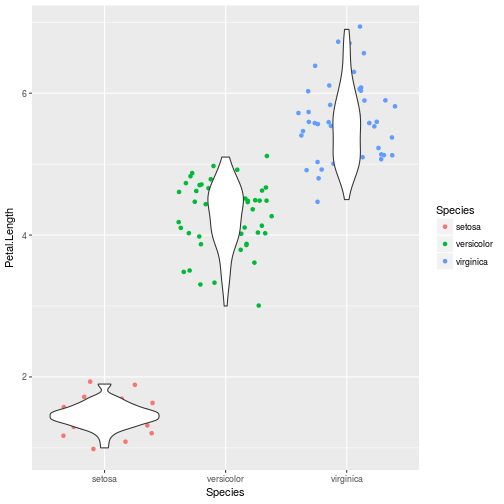

<style>
.reveal h1, .reveal h2, .reveal h3 {
  word-wrap: normal;
  -moz-hyphens: none;
}
</style>

<style>
.small-code pre code {
  font-size: 1em;
}
</style>

Clase 4 visualización de datos
========================================================
author: Derek Corcoran
date: "13/10, 2017"
autosize: true
transition: rotate

ggplot2
========================================================
class: small-code

* Paquete de visualización de datos de tidy data
* ggplot(data.frame, aes(nombres de columna))
* + geom_algo(argumentos, aes(columnas))
* + theme_algo() estilo
* Personalización de ejes y leyendas


```r
library(ggplot2)
data("diamonds")
ggplot(diamonds, aes(x = carat, y=price)) + geom_point(aes(color = cut))
```

***


Argumentos para geoms
=================

* **color**: color de lineas o puntos 
* **alpha**: transparencia, de 0 (transparente) a 1 (solido)
* **size**: tamaño de puntos
* **pch**: tipo de punto
* **fill**: color dentro de un area (barras, intervalos)

color
=================
class: small-code


```r
library(ggplot2)
data("diamonds")
ggplot(diamonds, aes(x = carat, y=price)) + geom_point(aes(color = cut)) + theme_classic()
```


alpha
=================
class: small-code


```r
library(ggplot2)
data("diamonds")
ggplot(diamonds, aes(x = carat, y=price)) + geom_point(aes(color = cut), alpha = 0.1) + theme_classic()
```


size
=================
class: small-code


```r
library(ggplot2)
data("mtcars")
ggplot(mtcars, aes(x = wt, y=mpg)) + geom_point(aes(size = hp)) + theme_classic()
```


shape
=================
class: small-code


```r
library(ggplot2)
data("diamonds")
ggplot(diamonds, aes(x = carat, y=price)) + geom_point(aes(shape = cut)) + theme_classic()
```



fill
=================
class: small-code


```r
library(ggplot2)
data("diamonds")
ggplot(diamonds, aes(x = cut, y=price)) + geom_boxplot(aes(fill = clarity)) + theme_classic()
```


Una variable categórica una continua
===========

* geom_boxplot
* geom_jitter
* geom_violin
* geom_bar

geom_jitter
==================
class: small-code


```r
data("iris")
ggplot(iris, aes(x = Species, y = Petal.Length)) + geom_jitter(aes(color = Species))
```


geom_violin
================
class: small-code


```r
data("iris")
ggplot(iris, aes(x = Species, y = Petal.Length)) + geom_violin(fill = "red")
```


Se pueden combinar
============
class: small-code


```r
data("iris")
ggplot(iris, aes(x = Species, y = Petal.Length)) + geom_violin() + geom_jitter(aes(color = Species))
```


Pero el orden importa
============
class: small-code


```r
data("iris")
ggplot(iris, aes(x = Species, y = Petal.Length)) + geom_jitter(aes(color = Species)) + geom_violin()
```




Dos variables continuas
===========

* geom_point
* geom_smooth
* geom_line
* geom_hex
* geom_rug
