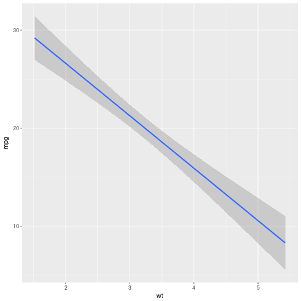

<style>
.reveal h1, .reveal h2, .reveal h3 {
  word-wrap: normal;
  -moz-hyphens: none;
}
</style>

<style>
.small-code pre code {
  font-size: 1em;
}
</style>

Clase 5 Modelos y loops
========================================================
author: Derek Corcoran
date: "15/10, 2017"
autosize: true
transition: rotate

paquetes a usar en esta clase
========================

<STYLE TYPE="text/css">
<!--
  td{
    font-family: Arial; 
    font-size: 4pt;
    padding:0px;
    cellpadding="0";
    cellspacing="0"
  }
  th {
    font-family: Arial; 
    font-size: 4pt;
    height: 20px;
    font-weight: bold;
    text-align: right;
    background-color: #ccccff;
  }
  table { 
    border-spacing: 0px;
    border-collapse: collapse;
  }
--->
</STYLE>

incremental:true

* sjPlot
* caret
* MuMIn
* Purrr

Modelo lineal simple
========================================================
class: small-code

```r
library(dplyr)
TempHum <- readRDS("TempHum.rds")
Pun <- TempHum %>% filter(Ciudad_localidad == "Punta Arenas")
Lineal <- lm(TempMedia ~ mes, data = TempHum)
Cuad <- lm(TempMedia ~ mes + I(mes^2), data = TempHum)
stargazer::stargazer(Lineal, Cuad, type = "html",  single.row = TRUE, model.names = TRUE, model.numbers = FALSE)
```

***

<table style="text-align:center"><tr><td colspan="3" style="border-bottom: 1px solid black"></td></tr><tr><td style="text-align:left"></td><td colspan="2"><em>Dependent variable:</em></td></tr>
<tr><td></td><td colspan="2" style="border-bottom: 1px solid black"></td></tr>
<tr><td style="text-align:left"></td><td colspan="2">TempMedia</td></tr>
<tr><td style="text-align:left"></td><td>(1)</td><td>(2)</td></tr>
<tr><td colspan="3" style="border-bottom: 1px solid black"></td></tr><tr><td style="text-align:left">mes</td><td>-0.284<sup>***</sup> (0.018)</td><td>-3.716<sup>***</sup> (0.069)</td></tr>
<tr><td style="text-align:left">I(mes2)</td><td></td><td>0.264<sup>***</sup> (0.005)</td></tr>
<tr><td style="text-align:left">Constant</td><td>14.582<sup>***</sup> (0.132)</td><td>22.560<sup>***</sup> (0.195)</td></tr>
<tr><td colspan="3" style="border-bottom: 1px solid black"></td></tr><tr><td style="text-align:left">Observations</td><td>8,972</td><td>8,972</td></tr>
<tr><td style="text-align:left">R<sup>2</sup></td><td>0.027</td><td>0.246</td></tr>
<tr><td style="text-align:left">Adjusted R<sup>2</sup></td><td>0.027</td><td>0.245</td></tr>
<tr><td style="text-align:left">Residual Std. Error</td><td>5.898 (df = 8970)</td><td>5.194 (df = 8969)</td></tr>
<tr><td style="text-align:left">F Statistic</td><td>249.720<sup>***</sup> (df = 1; 8970)</td><td>1,459.989<sup>***</sup> (df = 2; 8969)</td></tr>
<tr><td colspan="3" style="border-bottom: 1px solid black"></td></tr><tr><td style="text-align:left"><em>Note:</em></td><td colspan="2" style="text-align:right"><sup>*</sup>p<0.1; <sup>**</sup>p<0.05; <sup>***</sup>p<0.01</td></tr>
</table>

Modelo lineal generalizado
========================================================
incremental:true
* Se agrega el argumento **family =**
* gaussian (variable independiente continua)
* binomial (variable independiente 0 o 1)
* poissson (variable independiente cuentas 1, 2 ,3 ,4 ,5)
* gamma (variable independiente continua solo positiva)

Selección de modelos
=======================
class: small-code
incremental:true


```r
data("mtcars")
Eficiencia <- glm(mpg ~. , data = mtcars)
```
* Se parte del modelo general (Muchos predictores)
* Paquete MuMIn calcula AICc (o AIC o BIC) para cada modelo
* Se ordena desde el menor IC al mayor IC
* En general reportamos un delta AIC de 2

Selección de modelos
=======================
class: small-code

```r
library(MuMIn)
library(kableExtra)
library(knitr)
options(na.action = "na.fail")
Select <- dredge(Eficiencia)
Select <-subset(Select, delta <= 2)
Select <-as.data.frame(Select)
Select <- Select[,colSums(is.na(Select))<nrow(Select)]
kable(Select, digits = 2)
```


|    | (Intercept)|   am|  carb|   cyl|    hp| qsec|    wt| df| logLik|   AICc| delta| weight|
|:---|-----------:|----:|-----:|-----:|-----:|----:|-----:|--:|------:|------:|-----:|------:|
|642 |        9.62| 2.94|    NA|    NA|    NA| 1.23| -3.92|  5| -72.06| 156.43|  0.00|   0.23|
|517 |       39.69|   NA|    NA| -1.51|    NA|   NA| -3.19|  4| -74.01| 157.49|  1.06|   0.13|
|706 |       17.44| 2.93|    NA|    NA| -0.02| 0.81| -3.24|  6| -71.16| 157.69|  1.26|   0.12|
|581 |       38.75|   NA|    NA| -0.94| -0.02|   NA| -3.17|  5| -72.74| 157.78|  1.36|   0.12|
|644 |       12.90| 3.51| -0.49|    NA|    NA| 1.02| -3.43|  6| -71.28| 157.92|  1.50|   0.11|
|519 |       39.60|   NA| -0.49| -1.29|    NA|   NA| -3.16|  5| -72.81| 157.93|  1.50|   0.11|
|577 |       37.23|   NA|    NA|    NA| -0.03|   NA| -3.88|  4| -74.33| 158.13|  1.71|   0.10|
|641 |       19.75|   NA|    NA|    NA|    NA| 0.93| -5.05|  4| -74.36| 158.20|  1.77|   0.09|

Modelo lineal generalizado (familia: binomial)
========================================================
class: small-code


```r
data("Titanic")
library(epitools)
Titanic2 <- expand.table(Titanic)
knitr::kable(head(Titanic2))
```


|Class |Sex  |Age   |Survived |
|:-----|:----|:-----|:--------|
|1st   |Male |Child |Yes      |
|1st   |Male |Child |Yes      |
|1st   |Male |Child |Yes      |
|1st   |Male |Child |Yes      |
|1st   |Male |Child |Yes      |
|1st   |Male |Adult |No       |

Modelo lineal generalizado (familia: binomial)
========================================================
class: small-code


```r
Titanic2$Survived <- ifelse(Titanic2$Survived == "Yes", 1, 0)
library(ggplot2)
ggplot(Titanic2, aes(x = Class, y = Survived)) + geom_violin(aes(fill = Sex)) 
```



Modelo lineal generalizado (familia: binomial)
========================================================
class: small-code

```r
ModeloTitanic <- glm(Survived ~.,family=binomial() ,data = Titanic2)
stargazer::stargazer(ModeloTitanic, type = "html",  single.row = TRUE)
```


<table style="text-align:center"><tr><td colspan="2" style="border-bottom: 1px solid black"></td></tr><tr><td style="text-align:left"></td><td><em>Dependent variable:</em></td></tr>
<tr><td></td><td colspan="1" style="border-bottom: 1px solid black"></td></tr>
<tr><td style="text-align:left"></td><td>Survived</td></tr>
<tr><td colspan="2" style="border-bottom: 1px solid black"></td></tr><tr><td style="text-align:left">Class2nd</td><td>-1.018<sup>***</sup> (0.196)</td></tr>
<tr><td style="text-align:left">Class3rd</td><td>-1.778<sup>***</sup> (0.172)</td></tr>
<tr><td style="text-align:left">ClassCrew</td><td>-0.858<sup>***</sup> (0.157)</td></tr>
<tr><td style="text-align:left">SexFemale</td><td>2.420<sup>***</sup> (0.140)</td></tr>
<tr><td style="text-align:left">AgeAdult</td><td>-1.062<sup>***</sup> (0.244)</td></tr>
<tr><td style="text-align:left">Constant</td><td>0.685<sup>**</sup> (0.273)</td></tr>
<tr><td colspan="2" style="border-bottom: 1px solid black"></td></tr><tr><td style="text-align:left">Observations</td><td>2,201</td></tr>
<tr><td style="text-align:left">Log Likelihood</td><td>-1,105.031</td></tr>
<tr><td style="text-align:left">Akaike Inf. Crit.</td><td>2,222.061</td></tr>
<tr><td colspan="2" style="border-bottom: 1px solid black"></td></tr><tr><td style="text-align:left"><em>Note:</em></td><td style="text-align:right"><sup>*</sup>p<0.1; <sup>**</sup>p<0.05; <sup>***</sup>p<0.01</td></tr>
</table>

Modelo lineal generalizado (familia: binomial)
========================================================
class: small-code

```r
library(MuMIn)
options(na.action = "na.fail")
select <- dredge(ModeloTitanic)
select <-subset(select, delta <= 20)
knitr::kable(select)
```


|   | (Intercept)|Age |Class |Sex | df|    logLik|     AICc|    delta|    weight|
|:--|-----------:|:---|:-----|:---|--:|---------:|--------:|--------:|---------:|
|8  |   0.6853195|+   |+     |+   |  6| -1105.031| 2222.099|  0.00000| 0.9997797|
|7  |  -0.3531200|NA  |+     |+   |  5| -1114.456| 2238.940| 16.84076| 0.0002203|

Visualizando modelos (Paquete sjPlot)
========================================================


Expandiendo los modelos que puedo usar paquete caret
===========================================


función train
===================


loops
=============


tidy loops con purrr
====================
