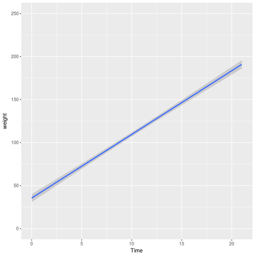
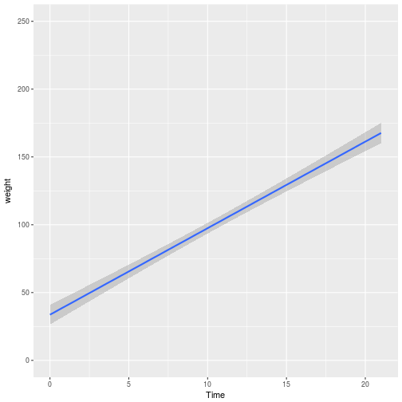

<style>
.reveal h1, .reveal h2, .reveal h3 {
  word-wrap: normal;
  -moz-hyphens: none;
}
</style>

<style>
.small-code pre code {
  font-size: 1em;
}
</style>


Clase6 Loops (purrr) y bibliografia (rticles)
========================================================
author: Derek Corcoran
date: "19/10, 2017"
autosize: true
transition: rotate

¿Qué es un loop?
========================================================
incremental:true

### Para Cada x has y

* Copiar y pegar
* for loops
* familia apply
* purrr!!!!!

***


purrr
========================================================
* loops en el tidyverse
* Pongan la base da datos "swapi" en su carpeta de trabajo (busquenla usando getwd())
* ejecuten *load("swapi.rda")*
  + ¿Cuantos elementos hay en people? (87)
  + Quien es la primera persona en people? (luke skywalker)
  + 


========================================================

# map(.x , .f)

* para cada elemento de .x, has .f
* .x = puede ser un vector, lista o dataframe (para cada columna)
* .f = usualmente una función

map()
==========
class: small-code

* en cuantas naves estuvo luke


```r
load("swapi.rda")
length(people[[1]]$films)
```

```
[1] 5
```

map()
==========
class: small-code


```r
library(purrr)
map(people, ~ length(.x$starships))
```

```
[[1]]
[1] 2

[[2]]
[1] 0

[[3]]
[1] 0

[[4]]
[1] 1

[[5]]
[1] 0

[[6]]
[1] 0

[[7]]
[1] 0

[[8]]
[1] 0

[[9]]
[1] 1

[[10]]
[1] 5

[[11]]
[1] 3

[[12]]
[1] 0

[[13]]
[1] 2

[[14]]
[1] 2

[[15]]
[1] 0

[[16]]
[1] 0

[[17]]
[1] 1

[[18]]
[1] 1

[[19]]
[1] 0

[[20]]
[1] 0

[[21]]
[1] 1

[[22]]
[1] 0

[[23]]
[1] 0

[[24]]
[1] 1

[[25]]
[1] 0

[[26]]
[1] 0

[[27]]
[1] 0

[[28]]
[1] 1

[[29]]
[1] 0

[[30]]
[1] 1

[[31]]
[1] 0

[[32]]
[1] 0

[[33]]
[1] 0

[[34]]
[1] 0

[[35]]
[1] 0

[[36]]
[1] 0

[[37]]
[1] 1

[[38]]
[1] 0

[[39]]
[1] 0

[[40]]
[1] 0

[[41]]
[1] 0

[[42]]
[1] 1

[[43]]
[1] 0

[[44]]
[1] 0

[[45]]
[1] 0

[[46]]
[1] 0

[[47]]
[1] 0

[[48]]
[1] 0

[[49]]
[1] 0

[[50]]
[1] 0

[[51]]
[1] 0

[[52]]
[1] 0

[[53]]
[1] 0

[[54]]
[1] 0

[[55]]
[1] 1

[[56]]
[1] 0

[[57]]
[1] 1

[[58]]
[1] 0

[[59]]
[1] 0

[[60]]
[1] 0

[[61]]
[1] 0

[[62]]
[1] 0

[[63]]
[1] 0

[[64]]
[1] 0

[[65]]
[1] 0

[[66]]
[1] 0

[[67]]
[1] 0

[[68]]
[1] 0

[[69]]
[1] 0

[[70]]
[1] 0

[[71]]
[1] 0

[[72]]
[1] 0

[[73]]
[1] 0

[[74]]
[1] 0

[[75]]
[1] 0

[[76]]
[1] 0

[[77]]
[1] 1

[[78]]
[1] 0

[[79]]
[1] 0

[[80]]
[1] 0

[[81]]
[1] 0

[[82]]
[1] 0

[[83]]
[1] 0

[[84]]
[1] 1

[[85]]
[1] 0

[[86]]
[1] 0

[[87]]
[1] 3
```

Cuantos gramos al día sube un pollo?
==============
class: small-code

```r
data("ChickWeight")
library(ggplot2)
ggplot(ChickWeight, aes(x = Time, y = weight)) + geom_smooth(method = "lm") + ylim(c(0, 250))
```



***


```r
library(broom)
PesoPorDia <- lm(weight ~ Time, data = ChickWeight)
knitr::kable(tidy(PesoPorDia))
```


|term        |  estimate| std.error| statistic| p.value|
|:-----------|---------:|---------:|---------:|-------:|
|(Intercept) | 27.467425|  3.036464|   9.04586|       0|
|Time        |  8.803039|  0.239700|  36.72524|       0|


Cuantos gramos al día sube un pollo con la dieta 1?
==============
class: small-code


```r
library(dplyr)
dieta1 <- ChickWeight %>% filter(Diet == 1)
ggplot(dieta1, aes(x = Time, y = weight)) + geom_smooth(method = "lm") + ylim(c(0, 250))
```



***


```r
library(broom)
PesoPorDiaD1 <- lm(weight ~ Time, data = dieta1)
knitr::kable(tidy(PesoPorDiaD1))
```


|term        |  estimate| std.error| statistic| p.value|
|:-----------|---------:|---------:|---------:|-------:|
|(Intercept) | 30.930980| 4.0947530|  7.553808|       0|
|Time        |  6.841797| 0.3285903| 20.821667|       0|

Cuantos gramos al día sube un pollo con la dieta 1?
==============
class: small-code

```r
tidy(PesoPorDiaD1)
```

```
         term  estimate std.error statistic      p.value
1 (Intercept) 30.930980 4.0947530  7.553809 1.149958e-12
2        Time  6.841797 0.3285903 20.821667 9.811362e-54
```

```r
tidy(PesoPorDiaD1)$estimate
```

```
[1] 30.930980  6.841797
```

```r
tidy(PesoPorDiaD1)$estimate[2]
```

```
[1] 6.841797
```
Los pollos con la dieta 1 suben 6.84 gramos al día

Cuantos gramos al día sube un pollo en cada dieta?
===========
class: small-code


```r
data("ChickWeight")
library(ggplot2)
ggplot(ChickWeight, aes(x = Time, y = weight)) + geom_smooth(method = "lm", aes(fill = Diet))
```


map()
====
class: small-code


```r
library(broom)
ChickWeight %>%  split(.$Diet) %>%  map(~ lm(weight ~ Time, data = .)) %>% map(~ tidy(.x)$estimate[2])
```

```
$`1`
[1] 6.841797

$`2`
[1] 8.609136

$`3`
[1] 11.42287

$`4`
[1] 9.714366
```
