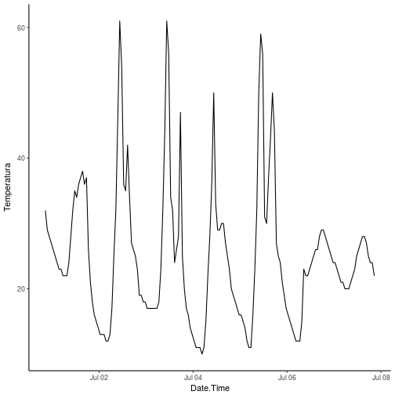
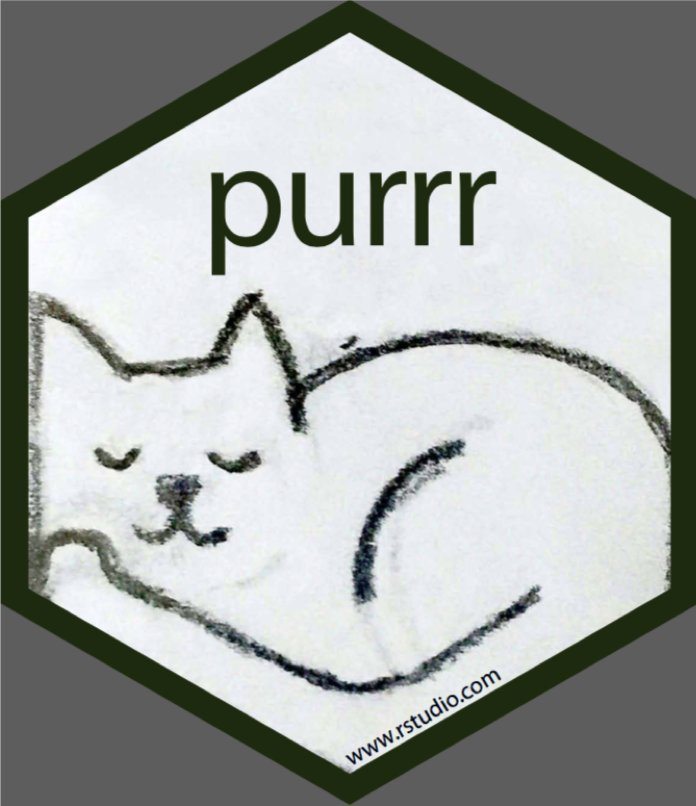

<style>
.reveal h1, .reveal h2, .reveal h3 {
  word-wrap: normal;
  -moz-hyphens: none;
}
</style>

<style>
.small-code pre code {
  font-size: 1em;
}
</style>


Clase6 Loops (purrr) y bibliografia (rticles)
========================================================
author: Derek Corcoran
date: "22/10, 2017"
autosize: true
transition: rotate

Ejercicio
===================
incremental:true
class: small-code

* Leer el archivo IB15Tem.csv de la carpeta T&H
* Este archivo es la temperatura medida cada una hora del sitio de estudio IB15
* Asegurarse que las fechas estén en formato fecha y no texto
* Eliminar columnas innecesarias
* Agregar una columna con el ID del sitio, en este caso IB15


```r
library(readr)
library(lubridate)
library(dplyr)
library(ggplot2)
```


Ejercicio
===================
incremental:true
class: small-code


```r
IB15Tem <- read_csv("~/Documents/CursoR/Clase6/T&H/IB15Tem.csv")
```


```r
IB15Tem <- read_csv("~/Documents/CursoR/Clase6/T&H/IB15Tem.csv") %>% rename(Temperatura = Value, Date.Time = `Date/Time`)
```


```r
IB15Tem <- read_csv("~/Documents/CursoR/Clase6/T&H/IB15Tem.csv") %>% rename(Temperatura = Value, Date.Time = `Date/Time`) %>% select(Date.Time, Temperatura)
```


```r
IB15Tem <- read_csv("~/Documents/CursoR/Clase6/T&H/IB15Tem.csv") %>% rename(Temperatura = Value, Date.Time = `Date/Time`) %>% select(Date.Time, Temperatura) %>% mutate(Date.Time = dmy_hms(Date.Time)) %>% mutate(ID = "IB15")
```

Ejercicio
===================
class: small-code

```r
knitr::kable(IB15Tem)
```


|Date.Time           | Temperatura|ID   |
|:-------------------|-----------:|:----|
|2015-06-30 20:34:01 |          32|IB15 |
|2015-06-30 21:34:01 |          29|IB15 |
|2015-06-30 22:34:01 |          28|IB15 |
|2015-06-30 23:34:01 |          27|IB15 |
|2015-07-01 00:34:01 |          26|IB15 |
|2015-07-01 01:34:01 |          25|IB15 |
|2015-07-01 02:34:01 |          24|IB15 |
|2015-07-01 03:34:01 |          23|IB15 |
|2015-07-01 04:34:01 |          23|IB15 |
|2015-07-01 05:34:01 |          22|IB15 |
|2015-07-01 06:34:01 |          22|IB15 |
|2015-07-01 07:34:01 |          22|IB15 |
|2015-07-01 08:34:01 |          24|IB15 |
|2015-07-01 09:34:01 |          28|IB15 |
|2015-07-01 10:34:01 |          32|IB15 |
|2015-07-01 11:34:01 |          35|IB15 |
|2015-07-01 12:34:01 |          34|IB15 |
|2015-07-01 13:34:01 |          36|IB15 |
|2015-07-01 14:34:01 |          37|IB15 |
|2015-07-01 15:34:01 |          38|IB15 |
|2015-07-01 16:34:01 |          36|IB15 |
|2015-07-01 17:34:01 |          37|IB15 |
|2015-07-01 18:34:01 |          26|IB15 |
|2015-07-01 19:34:01 |          21|IB15 |
|2015-07-01 20:34:01 |          18|IB15 |
|2015-07-01 21:34:01 |          16|IB15 |
|2015-07-01 22:34:01 |          15|IB15 |
|2015-07-01 23:34:01 |          14|IB15 |
|2015-07-02 00:34:01 |          13|IB15 |
|2015-07-02 01:34:01 |          13|IB15 |
|2015-07-02 02:34:01 |          13|IB15 |
|2015-07-02 03:34:01 |          12|IB15 |
|2015-07-02 04:34:01 |          12|IB15 |
|2015-07-02 05:34:01 |          13|IB15 |
|2015-07-02 06:34:01 |          17|IB15 |
|2015-07-02 07:34:01 |          25|IB15 |
|2015-07-02 08:34:01 |          32|IB15 |
|2015-07-02 09:34:01 |          46|IB15 |
|2015-07-02 10:34:01 |          61|IB15 |
|2015-07-02 11:34:01 |          54|IB15 |
|2015-07-02 12:34:01 |          36|IB15 |
|2015-07-02 13:34:01 |          35|IB15 |
|2015-07-02 14:34:01 |          42|IB15 |
|2015-07-02 15:34:01 |          34|IB15 |
|2015-07-02 16:34:01 |          27|IB15 |
|2015-07-02 17:34:01 |          26|IB15 |
|2015-07-02 18:34:01 |          25|IB15 |
|2015-07-02 19:34:01 |          23|IB15 |
|2015-07-02 20:34:01 |          19|IB15 |
|2015-07-02 21:34:01 |          19|IB15 |
|2015-07-02 22:34:01 |          18|IB15 |
|2015-07-02 23:34:01 |          18|IB15 |
|2015-07-03 00:34:01 |          17|IB15 |
|2015-07-03 01:34:01 |          17|IB15 |
|2015-07-03 02:34:01 |          17|IB15 |
|2015-07-03 03:34:01 |          17|IB15 |
|2015-07-03 04:34:01 |          17|IB15 |
|2015-07-03 05:34:01 |          17|IB15 |
|2015-07-03 06:34:01 |          18|IB15 |
|2015-07-03 07:34:01 |          23|IB15 |
|2015-07-03 08:34:01 |          32|IB15 |
|2015-07-03 09:34:01 |          44|IB15 |
|2015-07-03 10:34:01 |          61|IB15 |
|2015-07-03 11:34:01 |          56|IB15 |
|2015-07-03 12:34:01 |          34|IB15 |
|2015-07-03 13:34:01 |          32|IB15 |
|2015-07-03 14:34:01 |          24|IB15 |
|2015-07-03 15:34:01 |          26|IB15 |
|2015-07-03 16:34:01 |          28|IB15 |
|2015-07-03 17:34:01 |          47|IB15 |
|2015-07-03 18:34:01 |          25|IB15 |
|2015-07-03 19:34:01 |          20|IB15 |
|2015-07-03 20:34:01 |          17|IB15 |
|2015-07-03 21:34:01 |          16|IB15 |
|2015-07-03 22:34:01 |          14|IB15 |
|2015-07-03 23:34:01 |          13|IB15 |
|2015-07-04 00:34:01 |          12|IB15 |
|2015-07-04 01:34:01 |          11|IB15 |
|2015-07-04 02:34:01 |          11|IB15 |
|2015-07-04 03:34:01 |          11|IB15 |
|2015-07-04 04:34:01 |          10|IB15 |
|2015-07-04 05:34:01 |          11|IB15 |
|2015-07-04 06:34:01 |          15|IB15 |
|2015-07-04 07:34:01 |          22|IB15 |
|2015-07-04 08:34:01 |          28|IB15 |
|2015-07-04 09:34:01 |          36|IB15 |
|2015-07-04 10:34:01 |          50|IB15 |
|2015-07-04 11:34:01 |          33|IB15 |
|2015-07-04 12:34:01 |          29|IB15 |
|2015-07-04 13:34:01 |          29|IB15 |
|2015-07-04 14:34:01 |          30|IB15 |
|2015-07-04 15:34:01 |          30|IB15 |
|2015-07-04 16:34:01 |          27|IB15 |
|2015-07-04 17:34:01 |          25|IB15 |
|2015-07-04 18:34:01 |          23|IB15 |
|2015-07-04 19:34:01 |          20|IB15 |
|2015-07-04 20:34:01 |          19|IB15 |
|2015-07-04 21:34:01 |          18|IB15 |
|2015-07-04 22:34:01 |          17|IB15 |
|2015-07-04 23:34:01 |          16|IB15 |
|2015-07-05 00:34:01 |          16|IB15 |
|2015-07-05 01:34:01 |          15|IB15 |
|2015-07-05 02:34:01 |          14|IB15 |
|2015-07-05 03:34:01 |          12|IB15 |
|2015-07-05 04:34:01 |          11|IB15 |
|2015-07-05 05:34:01 |          11|IB15 |
|2015-07-05 06:34:01 |          16|IB15 |
|2015-07-05 07:34:01 |          23|IB15 |
|2015-07-05 08:34:01 |          32|IB15 |
|2015-07-05 09:34:01 |          50|IB15 |
|2015-07-05 10:34:01 |          59|IB15 |
|2015-07-05 11:34:01 |          56|IB15 |
|2015-07-05 12:34:01 |          31|IB15 |
|2015-07-05 13:34:01 |          30|IB15 |
|2015-07-05 14:34:01 |          37|IB15 |
|2015-07-05 15:34:01 |          43|IB15 |
|2015-07-05 16:34:01 |          50|IB15 |
|2015-07-05 17:34:01 |          44|IB15 |
|2015-07-05 18:34:01 |          27|IB15 |
|2015-07-05 19:34:01 |          25|IB15 |
|2015-07-05 20:34:01 |          24|IB15 |
|2015-07-05 21:34:01 |          21|IB15 |
|2015-07-05 22:34:01 |          19|IB15 |
|2015-07-05 23:34:01 |          17|IB15 |
|2015-07-06 00:34:01 |          16|IB15 |
|2015-07-06 01:34:01 |          15|IB15 |
|2015-07-06 02:34:01 |          14|IB15 |
|2015-07-06 03:34:01 |          13|IB15 |
|2015-07-06 04:34:01 |          12|IB15 |
|2015-07-06 05:34:01 |          12|IB15 |
|2015-07-06 06:34:01 |          12|IB15 |
|2015-07-06 07:34:01 |          15|IB15 |
|2015-07-06 08:34:01 |          23|IB15 |
|2015-07-06 09:34:01 |          22|IB15 |
|2015-07-06 10:34:01 |          22|IB15 |
|2015-07-06 11:34:01 |          23|IB15 |
|2015-07-06 12:34:01 |          24|IB15 |
|2015-07-06 13:34:01 |          25|IB15 |
|2015-07-06 14:34:01 |          26|IB15 |
|2015-07-06 15:34:01 |          26|IB15 |
|2015-07-06 16:34:01 |          28|IB15 |
|2015-07-06 17:34:01 |          29|IB15 |
|2015-07-06 18:34:01 |          29|IB15 |
|2015-07-06 19:34:01 |          28|IB15 |
|2015-07-06 20:34:01 |          27|IB15 |
|2015-07-06 21:34:01 |          26|IB15 |
|2015-07-06 22:34:01 |          25|IB15 |
|2015-07-06 23:34:01 |          24|IB15 |
|2015-07-07 00:34:01 |          24|IB15 |
|2015-07-07 01:34:01 |          23|IB15 |
|2015-07-07 02:34:01 |          22|IB15 |
|2015-07-07 03:34:01 |          21|IB15 |
|2015-07-07 04:34:01 |          21|IB15 |
|2015-07-07 05:34:01 |          20|IB15 |
|2015-07-07 06:34:01 |          20|IB15 |
|2015-07-07 07:34:01 |          20|IB15 |
|2015-07-07 08:34:01 |          21|IB15 |
|2015-07-07 09:34:01 |          22|IB15 |
|2015-07-07 10:34:01 |          23|IB15 |
|2015-07-07 11:34:01 |          25|IB15 |
|2015-07-07 12:34:01 |          26|IB15 |
|2015-07-07 13:34:01 |          27|IB15 |
|2015-07-07 14:34:01 |          28|IB15 |
|2015-07-07 15:34:01 |          28|IB15 |
|2015-07-07 16:34:01 |          27|IB15 |
|2015-07-07 17:34:01 |          25|IB15 |
|2015-07-07 18:34:01 |          24|IB15 |
|2015-07-07 19:34:01 |          24|IB15 |
|2015-07-07 20:34:01 |          22|IB15 |

Ejercicio
===================
class: small-code


```r
ggplot(IB15Tem, aes(x = Date.Time, y = Temperatura)) + geom_line() + theme_classic()
```




========================================================
# ¿Como lo hacemos con todos los archivos de la carpeta H&T?

ya tenemos una receta

¿Qué es un loop?
========================================================
incremental:true

### Para Cada x has y

* Creamos la receta
* Copiar y pegar
* for loops
* familia apply
* purrr!!!!!

***


========================================================
class: small-code

# map(.x , .f)

* para cada elemento de .x, has .f
* .x = puede ser un vector, lista o dataframe (para cada columna)
* .f = usualmente una función
* Siempre entrega una lista


```r
library(purrr)
x <- c(1,2,3,4,5,6,7,8,9,10)
map(.x =x, .f = sqrt)
```

```
[[1]]
[1] 1

[[2]]
[1] 1.414214

[[3]]
[1] 1.732051

[[4]]
[1] 2

[[5]]
[1] 2.236068

[[6]]
[1] 2.44949

[[7]]
[1] 2.645751

[[8]]
[1] 2.828427

[[9]]
[1] 3

[[10]]
[1] 3.162278
```

Volvamos a la receta basica
===========
class: small-code
incremental:true

```r
IB15Tem <- read_csv("~/Documents/CursoR/Clase6/T&H/IB15Tem.csv") %>% rename(Temperatura = Value, Date.Time = `Date/Time`) %>% select(Date.Time, Value) %>% mutate(Date.Time = dmy_hms(Date.Time)) %>% mutate(ID = "IB15")
```

* Vamos a la primera parte


```r
IB15Tem <- read_csv("~/Documents/CursoR/Clase6/T&H/IB15Tem.csv")
```

* ¿Que queremos?


```r
Temperaturas <- map(.x = ArchivosTemp, .f = read_csv)
```

* Necesitamos un vector o lista *ArchivosTemp* que contenga todos los archivos que vamos a leer

Si solo existiera una función que leyera todos los archivos de una carpeta
========
class: small-code
incremental:true


```r
setwd("/home/derek/Documents/CursoR/Clase6/T&H")
Archivos <- list.files()
```


```r
ArchivosTemp <- list.files(pattern = "Tem.csv")
```

Empezemos nuestro loop
====
class: small-code
incremental:true


```r
Temperaturas <- map(.x = ArchivosTemp, .f = read_csv)
```

* Si usamos una función tipo dplyr agregamos un ~ antes de la función y un .x en vez del data frame


```r
Temperaturas <- map(.x = ArchivosTemp, .f = read_csv) %>% map(~rename(.x, Temperatura = Value, Date.Time = `Date/Time`))
```

* A partir de esto podemos avanzar mucho


```r
Temperaturas <- ArchivosTemp %>% map(read_csv) %>% map(~rename(.x, Temperatura = Value, Date.Time = `Date/Time`)) %>% map(~mutate(.x, Date.Time = dmy_hms(Date.Time))) %>% map(~select(.x, Date.Time, Temperatura))
```


Tipos de map
==========
class: small-code

* *map()* entrega una lista :(
* *map_lgl()* entrega un vector logico
* *map_int()* entrega un vector de valores enteros
* *map_dbl()* entrega un vector numerico
* *map_chr()* entrega un vector de caracteres
* *walk()* no entrega nada, pero hace algo (exporta archivos, hace gráficos, etc)
* *reduce()*

