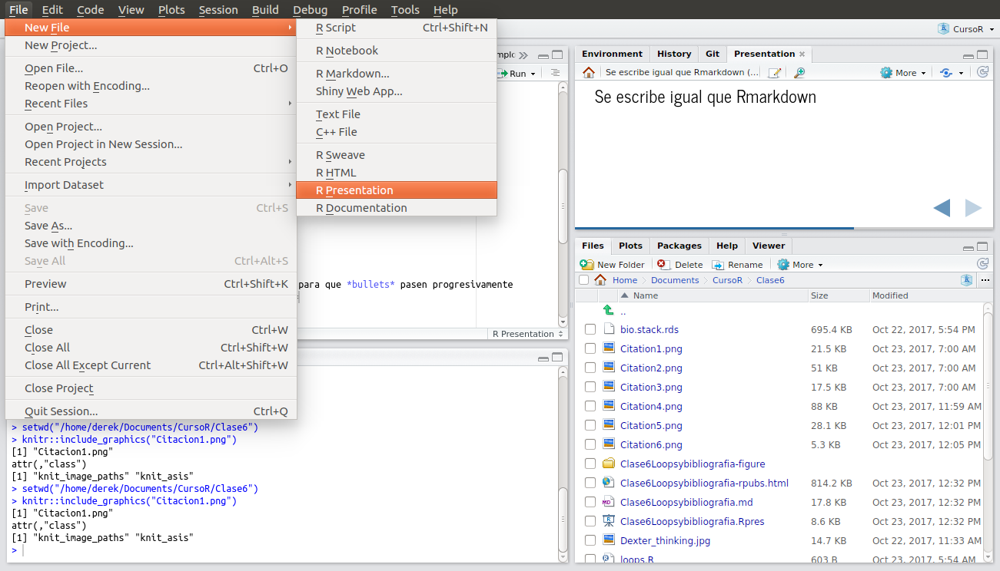

<style>
.reveal h1, .reveal h2, .reveal h3 {
  word-wrap: normal;
  -moz-hyphens: none;
}
</style>

<style>
.small-code pre code {
  font-size: 1em;
}
</style>

Clase 7 Presentaciones En R
========================================================
author: Derek Corcoran
date: "23/10, 2017"
autosize: true
transition: rotate

Tipos de presentaciones en R
========================================================
incremental:true

- **R presentation**
- [Ioslides](http://rmarkdown.rstudio.com/ioslides_presentation_format.html)
- Slidy
- Beamer (PDF)

Como abrir nueva presentación
==========




Se escribe igual que Rmarkdown
==========
incremental:true

* === es para pasar de una a otra diapo
* incremental:true justo debajo de los ==== es para que *bullets* pasen progresivamente
* El titulo de la diapo va justo sobre los ====
* si pongo *** entre dos elementos, apareceran en columans distintas

personalización CSS 
========

* Código HTML que permite personalizar presentaciones
* Se pone antes del YAML
* Puede ser sencillo como el siguiente


```r
<style>
.reveal h1, .reveal h2, .reveal h3 {
  word-wrap: normal;
  -moz-hyphens: none;
}
</style>
```


Dos CSS que suelo usar 
========
class: small-code
incremental:true


```r
<style>
.reveal h1, .reveal h2, .reveal h3 {
  word-wrap: normal;
  -moz-hyphens: none;
}
</style>
```

* Evita que se separen palabras en los títulos


```r
<style>
.small-code pre code {
  font-size: 1em;
}
</style>
```

* permite poner *class: small-code* bajo un ====
* Más ejemplos [acá](https://rstudio-pubs-static.s3.amazonaws.com/27777_55697c3a476640caa0ad2099fe914ae5.html#/)

Otras cosas
=====

* Texto normal

```r
<small>This sentence will appear smaller.</small>
```
* <small>This sentence will appear smaller.</small>
* Si se meten a la página del curso, cada carpeta de clase tiene un archivo RPres, que es el que creo la presentación


Ecuaciones
===========

```r
$$
  \begin{aligned}
  \dot{x} & = \sigma(y-x) \\
  \end{aligned}
$$  
```

$$
  \begin{aligned}
  \dot{x} & = \sigma(y-x) \\
  \end{aligned}
$$  


* [acá](http://www.statpower.net/Content/310/R%20Stuff/SampleMarkdown.html) pueden ver varios ejemplos de como hacer ecuaciones
